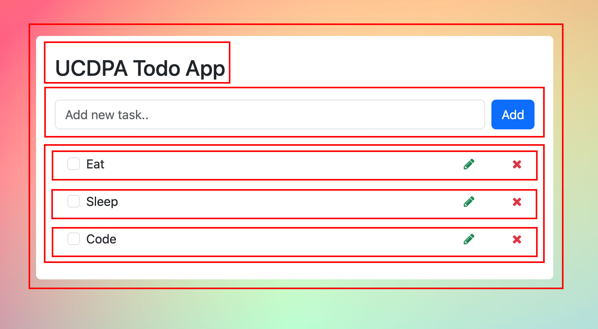
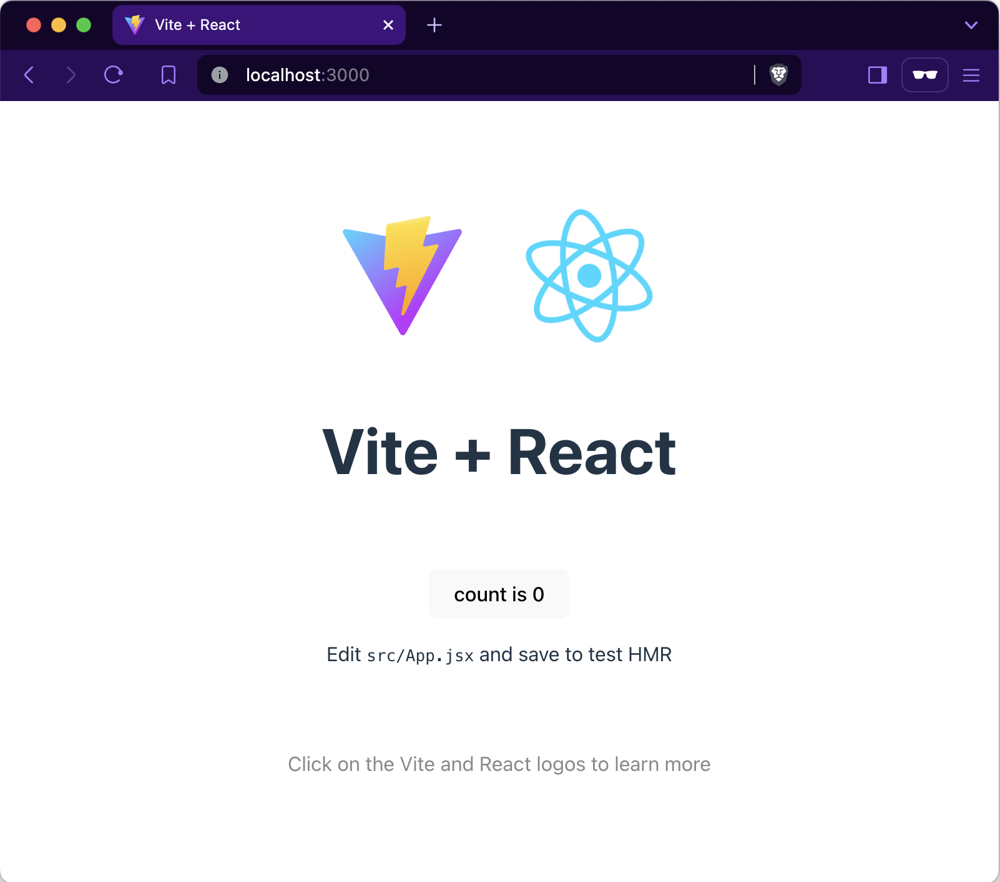

# React 01
# Introduction Topics

1. An introduction to React and its advantages.
2. An explanation of JSX (JavaScript XML) and how it's used in React.
3. Setting up a new React project using Vite.
4. Understanding the basic file structure of a React project.
5. Rendering elements in React.
6. A brief overview of components, props, and state.
7. How to handle events and build interactive UIs with React.

## 1. React and its advantages

React is a library for building user interfaces. React is not a framework – it's not even exclusive to the web. It's used with other libraries to render to certain environments. For instance, React Native can be used to build mobile applications.

React is declarative. You describe what you want to see, and React will build and manage the actual UI. React will efficiently update and render just the right components when your data changes.

React is component-based. You can build encapsulated components that manage their own state, then compose them to make complex UIs.



While React can be used for small pieces of an interface, it's not as easy to "drop into" an application as a library like jQuery, or even a framework like Vue — it is more approachable when you build your entire app with React.

## 2. JSX (JavaScript XML)

React utilises features of modern JavaScript for many of its patterns. Its biggest departure from JavaScript comes with the use of JSX syntax. JSX extends JavaScript's syntax so that HTML-like code can live alongside it. For example:

```js
const heading = <h1>Hello, world!</h1>;
```

JSX is not a requirement for using React, but it is recommended. It makes your code more readable and easier to write. JSX is similar to a template language, but it comes with the full power of JavaScript.

Your browser can't read JSX without help. When compiled (using a tool like Babel or Parcel), our header expression would look like this:

```js
const header = React.createElement(
  "header",
  null,
  React.createElement("h1", null, "Hello, world!")
);
```

## 3. Setting up a new React project

There are many ways to create a new React application. We're going to use Vite to create a new application via the command line.
In order to use Vite, you need to have Node.js installed. As of Vite 5.0, at least Node version 18 or later is required.

Switch to your terminal and follow these steps to create a new React project using Vite:

1. Check your version of Node

```bash
node -v
```

If Node is installed, you'll see a version number. If it isn't, you'll see an error message. To install Node, follow the instructions on the Node.js website.

NPM is a package manager for JavaScript. It's used to install and manage packages for Node.js. When you install Node.js, you also get NPM.

2. Initialise your application

```bash
npm create vite@latest ucdpa-todo-react -- --template react
```

To explain the command in more detail:

- `npm create vite@latest` tells npm to use the latest version of Vite to create a new project.
- `ucdpa-todo-react` is the name of the new directory that will be created.
- `-- --template react` tells Vite to use the React template when creating the project.

Your terminal will have printed some messages if this command was successful. You should see text prompting you to cd to your new directory, install the app's dependencies, and run the app locally.

```bash
Done. Now run:
  cd ucdpa-todo-react
  npm install
  npm run dev
```

3. Change into the new directory and install the app's dependencies

```bash
cd ucdpa-todo-react && npm install
```

4. Run the app locally

```bash
npm run dev -- --open --port 3000
# or basically
npm run dev
```

This command will open your new React application in your default browser on port `3000`.

If you switch to your browser, you will see the following screen:


### Useful Websites:

- React: https://reactjs.org/
- Vite: https://vitejs.dev/
- Node.js: https://nodejs.org/

## 4. Basic file structure of a React project

When you create a new React project using Vite, you'll see a file structure similar to the following:

```
  ucdpa-todo-react
  ├── README.md
  ├── index.html
  ├── node_modules
  ├── package-lock.json
  ├── package.json
  ├── public
  │   └── vite.svg
  ├── src
  │   ├── App.css
  │   ├── App.jsx
  │   ├── assets
  │   │   └── react.svg
  │   ├── index.css
  │   └── main.jsx
  └── vite.config.js
```

Let's break down the contents of this directory:

- `index.html`: This file is the entry point for your application.
- `node_modules`: This directory contains all the dependencies for your project.
- `public`: This directory contains the public assets for your project, such as images, fonts, and the index.html file.
- `src`: This directory contains the source code for your project.
- `package.json` and `package-lock.json`: Contain metadata about your project, as well as the project's dependencies.
- `README.md`: This file contains information about your project.
- `vite.config.js`: This file contains configuration options for Vite.

## 5. Rendering elements in React

In React, you can render elements using JSX syntax. Elements are the smallest building blocks of React applications. For example, you can render a simple heading element like this:

```js
const heading = <h1>Hello, world!</h1>;
```

Let's open `src/App.jsx`, since our browser is prompting us to edit it. This file contains our first component, `<App />`:

```js
import { useState } from "react";
import reactLogo from "./assets/react.svg";
import viteLogo from "/vite.svg";
import "./App.css";

function App() {
  const [count, setCount] = useState(0);

  return (
    <>
      <div>
        <a href="https://vitejs.dev" target="_blank">
          
        </a>
        <a href="https://react.dev" target="_blank">
          
        </a>
      </div>
      <h1>Vite + React</h1>
      <div className="card">
        <button onClick={() => setCount((count) => count + 1)}>
          count is {count}
        </button>
        <p>
          Edit <code>src/App.jsx</code> and save to test HMR
        </p>
      </div>
      <p className="read-the-docs">
        Click on the Vite and React logos to learn more
      </p>
    </>
  );
}

export default App;
```

This code consists of three parts:

1. Import statements: The import statements at the top of the file allow `App.jsx` to use code that has been defined elsewhere. For example, We import the `useState` hook from React, as well as the React and Vite logos and the CSS file for our component.

```js
import { useState } from "react";
import reactLogo from "./assets/react.svg";
import viteLogo from "/vite.svg";
import "./App.css";
```

2. The `App` component: This component returns JSX elements that make up the component's UI, thus defines what your browser ultimately renders to the DOM.
3. Export statement: We export the `App` component so that it can be used in other parts of our application.

Let's open `src/main.jsx`, because that's where the `<App />` component is being used. This file is the entry point for our app, and it initially looks like this:

```js
import React from "react";
import ReactDOM from "react-dom/client";
import App from "./App.jsx";
import "./index.css";

ReactDOM.createRoot(document.getElementById("root")).render(
  <React.StrictMode>
    <App />
  </React.StrictMode>
);
```

This code consists of three parts:

1. Import statements: We import React and ReactDOM, as well as the `App` component and the CSS file for our application.
2. The `ReactDOM.createRoot` method: This method is used to render the `App` component to the DOM. We pass the `App` component to the `ReactDOM.createRoot` method, which renders the component inside the `root` element in the `index.html` file.
3. The `<React.StrictMode>` component: This component is used to highlight potential problems in your application. It does not render any visible UI, but it activates additional checks and warnings for its descendants.

### Starting from Scratch

If you want to start from scratch, you can delete the contents of the `App.jsx` and add the following code:

```js
import "./App.css";

function App() {
  return (
    <>
      <header>
        <h1>Hello, World!</h1>
      </header>
    </>
  );
}

export default App;
```

JSX elements can have attributes, just like HTML elements. Try adding a `<button>` below the `<h1>` element in your `App.jsx` file, like this:

```js
<header>
  <h1>Hello, World!</h1>
  <button>Click me!</button>
</header>
```

When you save the file, your browser will automatically update to show the new button.

Some attributes are different than their HTML counterparts. For example, the `class` attribute in HTML translates to `className` in JSX. This is because `class` is a reserved word in JavaScript, and JSX is a JavaScript extension. If you wanted to add a primary class to your button, you'd write it like this:

```js
<button className="primary">Click me!</button>
```

### Useful Websites:

- JSX: https://reactjs.org/docs/introducing-jsx.html
- Elements: https://reactjs.org/docs/rendering-elements.html

## 6. Components, props, and state

React is all about components. Components are like JavaScript functions. They accept inputs (called props) and return React elements describing what should appear on the screen.

### Components

Components let you split the UI into independent, reusable pieces, and think about each piece in isolation. Conceptually, components are like JavaScript functions. They accept arbitrary inputs (called "props") and return React elements describing what should appear on the screen.

Components can be defined in two ways: as functions or as classes. Function components are the simplest way to define a component in React. They are just JavaScript functions that accept props and return React elements.  
It's worth mentioning that the functional components were introduced in React 16.8. They are also known as stateless components.

### Example

Let's modify the code for `<App />` in `src/App.jsx`:

```js
function App() {
  const subject = "React";
  return (
    <>
      <header>
        <h1>Hello, {subject}!</h1>
        <button className="primary">Click me!</button>
      </header>
    </>
  );
}
```

Now React will render a heading that says "Hello, React!", and the name "React" is stored in the `subject` variable.

Change the content of `<h1>` and check the following outputs:

```js
{
  /* Hello, React :)! */
}
<h1>Hello, {subject + " :)"}!</h1>;
{
  /* Hello, REACT */
}
<h1>Hello, {subject.toUpperCase()}</h1>;
{
  /* Hello, 4 */
}
<h1>Hello, {2 + 2}!</h1>;
```

Even comments in JSX are written inside curly braces! This is because comments, too, are technically JavaScript expressions. The `/* block comment syntax */` is necessary for your program to know where the comment starts and ends.

### Props

Props are inputs to a React component. They are passed from a parent component to a child component. Props are read-only, which means that a child component cannot modify the props it receives from a parent component.

Here's an example of a function component that accepts a `name` prop and returns a greeting message:

```js
function Greeting(props) {
  return <h1>Hello, {props.name}!</h1>;
}
```

You can use the `Greeting` component like this:

```js
<Greeting name="Alice" />
<Greeting name="Bob" />
```

#### Using Props

Open `src/main.jsx` and modify the `App` component to accept a `name` prop. Replace the line that renders the `App` component with the following code:

```js
<App name="Alice" />
```

Now, modify the `App` component in `src/App.jsx` to accept the `name` prop and use it in the greeting message:

```js
function App(props) {
  console.log(props);
  const subject = "React";
  return (
    <>
      <header>
        <h1>Hello, {subject}!</h1>
        <button className="primary">Click me!</button>
      </header>
    </>
  );
}
```

If you open your browser's developer console, you'll see a message that looks like this:

```js
Object { name: "Alice" }
```

To make a use of the `name` prop, replace the `subject` variable with `props.name`:

```js
const subject = props.name;
```

or

```js
function App(props) {
  return (
    <>
      <header>
        <h1>Hello, {props.name}!</h1>
        <button className="primary">Click me!</button>
      </header>
    </>
  );
}
```

### State

State is similar to props, but it is private and fully controlled by the component. State is used to store data that can change over time. When the state of a component changes, the component re-renders.

To add state to a function component, you can use the `useState` hook from React. The `useState` hook returns an array with two elements: the current state value and a function that lets you update it.

Here's an example of a function component that uses the `useState` hook to manage a count state:

```js
import { useState } from "react";
import "./App.css";

function App(props) {
  const [count, setCount] = useState(0);
  return (
    <>
      <header>
        <h1>Hello, {props.name}!</h1>
        <button
          className="primary"
          onClick={() => setCount((count) => count + 1)}
        >
          count is {count}
        </button>
      </header>
    </>
  );
}

export default App;
```

In this example, we use the `useState` hook to create a `count` state variable with an initial value of `0`. We also use the `setCount` function to update the `count` state variable when the button is clicked.

### Useful Websites:

- Components: https://reactjs.org/docs/components-and-props.html
- State and Lifecycle: https://reactjs.org/docs/state-and-lifecycle.html

## 7. Handling events and building interactive UIs

React provides a way to handle events in components. You can use event handlers to respond to user actions, such as clicking a button or typing in an input field.

To handle events in React, you can pass a function as a prop to an event handler. The function will be called when the event occurs.

Example:

```js
function handleClick() {
  console.log("Button clicked!");
}
```

You can use the `onClick` event handler to call the `handleClick` function when a button is clicked:

```js
<button onClick={handleClick}>Click me!</button>
```

The final code for the `App` component in `src/App.jsx` looks like this:

```js
import { useState } from "react";
import "./App.css";

function App(props) {
  const [count, setCount] = useState(0);

  function handleClick() {
    console.log("Button clicked!");
  }

  return (
    <>
      <header>
        <h1>Hello, {props.name}!</h1>
        <button
          className="primary"
          onClick={() => setCount((count) => count + 1)}
        >
          count is {count}
        </button>

        <button onClick={handleClick}>Click me!</button>
      </header>
    </>
  );
}

export default App;
```

When you click the button, you should see a message in the console that says "Button clicked!".

This code uses all of the following React concepts:

- Components: The `App` component is a function component that accepts a `name` prop and returns a greeting message.
- Props: The `name` prop is passed to the `App` component from the `main.jsx` file.
- State: The `count` state variable is used to keep track of the number of times the button is clicked.
- Event handling: The `onClick` event handler is used to increment the `count` state variable when the button is clicked.


# Starting Our Todo App

Now that we have a basic understanding of React, let's start building our todo app.

For our Todo App, the user should be able to:

- read a list of tasks.
- add a task.
- mark any task as completed.
- delete any task.
- edit any task.
- view a specific subset of tasks: All tasks, only the active task, or only the completed tasks.

First, let's clean up the project.
Go to your terminal and perform the following steps:

```bash
# Move into the src directory
cd src
# Delete the App.css file and the React logo provided by Vite
rm App.css assets/react.svg
# Empty the contents of App.jsx and index.css
echo -n > App.jsx && echo -n > index.css
# Move back up to the root of the project
cd ..
```

Notice that:

1. We removed the files `App.css` and `react.svg` from the `src` directory.
2. We emptied the contents of `App.jsx` and `index.css`.

Now, let's start building our Todo App.

1. Insert the following code in `index.css`

```css
/* this code sets the background of the app to a colourful gradient */
#root {
  background: radial-gradient(50% 123.47% at 50% 50%, #00ff94 0%, #720059 100%),
    linear-gradient(121.28deg, #669600 0%, #ff0000 100%), linear-gradient(
      360deg,
      #0029ff 0%,
      #8fff00 100%
    ), radial-gradient(100% 164.72% at 100% 100%, #6100ff 0%, #00ff57 100%),
    radial-gradient(100% 148.07% at 0% 0%, #fff500 0%, #51d500 100%);
  background-blend-mode: screen, color-dodge, overlay, difference, normal;
  height: 100vh;
}

/* this code makes use of the new CSS ":has()" selector to put a line through completed tasks if the list item has a checked checkbox */
li.list-group-item div:has(:checked) {
  text-decoration: line-through;
}
```

2. Remove the props we passed to `<App />` in `src/main.jsx`.

```js
import React from "react";
import ReactDOM from "react-dom/client";
import App from "./App.jsx";
import "./index.css";

ReactDOM.createRoot(document.getElementById("root")).render(
  <React.StrictMode>
    <App />
  </React.StrictMode>
);
```

3. Remove the unwanted code from `index.html`.
   The file should look like this:

```html
<!DOCTYPE html>
<html lang="en">
  <head>
    <meta charset="UTF-8" />
    <meta name="viewport" content="width=device-width, initial-scale=1.0" />
    <title>UCDPA Todo App</title>
  </head>
  <body>
    <div id="root"></div>
    <script type="module" src="/src/main.jsx"></script>
  </body>
</html>
```

4. Insert the following code in `App.jsx`:

```js
import "bootstrap/dist/css/bootstrap.min.css";
import "font-awesome/css/font-awesome.min.css";

const App = () => {
  return (
    <div className="container pt-5">
      <div className="row justify-content-center">
        <div className="col col-md-6 col-span-1 bg-white rounded p-4">
          <h3 className="mb-4">UCDPA Todo App</h3>
          <form className="d-flex justify-content-center align-items-center mb-4">
            <div className="form-outline flex-fill">
              <input
                type="text"
                className="form-control"
                placeholder="Add new task.."
              />
            </div>
            <button type="submit" className="btn btn-primary ms-2">
              Add
            </button>
          </form>

          <div className="tab-content" id="ex1-content">
            <ul className="list-group mb-0">
              <li className="list-group-item d-flex align-items-center justify-content-between border-0 mb-2">
                <div>
                  <input
                    className="form-check-input me-2"
                    type="checkbox"
                    value=""
                  />
                  Eat
                </div>
                <div>
                  <span className="fa fa-pencil text-success mx-5"></span>
                  <span className="fa fa-times text-danger"></span>
                </div>
              </li>
              <li className="list-group-item d-flex align-items-center justify-content-between border-0 mb-2">
                <div>
                  <input
                    className="form-check-input me-2"
                    type="checkbox"
                    value=""
                  />
                  Sleep
                </div>
                <div>
                  <span className="fa fa-pencil text-success mx-5"></span>
                  <span className="fa fa-times text-danger"></span>
                </div>
              </li>
              <li className="list-group-item d-flex align-items-center justify-content-between border-0 mb-2">
                <div>
                  <input
                    className="form-check-input me-2"
                    type="checkbox"
                    value=""
                  />
                  Code
                </div>
                <div>
                  <span className="fa fa-pencil text-success mx-5"></span>
                  <span className="fa fa-times text-danger"></span>
                </div>
              </li>
            </ul>
          </div>
        </div>
      </div>
    </div>
  );
};

export default App;
```

The above code is importing Bootstrap and Font Awesome CSS files. You can install these libraries using the following commands:

```bash
npm install --save bootstrap
npm install --save font-awesome
```

Note that we are using the flag `--save` to save the libraries as dependencies in the `package.json` file.

The code in our `App.jsx` file creates a simple form for adding tasks and a list of tasks. Each task has a checkbox, a text, and two icons for editing and deleting the task.

We are defining each task manually by adding a `<li>` element for each task. In a real-world application, tasks would be stored in a database and fetched dynamically.

Let's run our application to see how it looks.

Our next step is to convert the tasks into a dynamic list that can be updated by the user.

Add a list of tasks as an array of objects in the `App.jsx` file:

```js
const tasks = [
  { id: 1, text: "Eat", completed: false },
  { id: 2, text: "Sleep", completed: false },
  { id: 3, text: "Code", completed: false },
];
```

Now, we can map over the `tasks` array and render each task dynamically. Replace the `<ul>` element in the `App.jsx` file with the following code:

```js
<ul className="list-group mb-0">
  {tasks.map((task) => (
    <li
      key={task.id}
      className="list-group-item d-flex align-items-center justify-content-between border-0 mb-2"
    >
      <div>
        <input
          className="form-check-input me-2"
          type="checkbox"
          value=""
          checked={task.completed}
        />
        {task.text}
      </div>
      <div>
        <span className="fa fa-pencil text-success mx-5"></span>
        <span className="fa fa-times text-danger"></span>
      </div>
    </li>
  ))}
</ul>
```

Note that we have a new HTML attribute `key` in the `<li>` element. The `key` attribute is used by React to identify each list item uniquely. It helps React to efficiently update the list when items are added, removed, or reordered.

If we switched to our browser, we may not feel any difference in the UI. However, we have successfully converted our static list of tasks into a dynamic list that can be updated.

To check if our line-through CSS is working, we can update the `completed` property of the first task to `true`:

```js
const tasks = [
  { id: 1, text: "Eat", completed: true },
  { id: 2, text: "Sleep", completed: false },
  { id: 3, text: "Code", completed: false },
];
```

If we switch back to our browser, we should see the first task with a line-through.

Since we are planning to have our tasks updated dynamically, we need to manage the tasks in the component's state.

First import the `useState` hook at the top of the `App.jsx` file:

```js
import { useState } from "react";
```

Then replace the `tasks` array with the following:

```js
// State to manage the list of tasks
const [tasks, setTasks] = useState([
  { id: 1, text: "Eat", completed: false },
  { id: 2, text: "Sleep", completed: false },
  { id: 3, text: "Code", completed: false },
]);
```

We are using the `useState` hook to create a state variable `tasks` and a function `setTasks` to update the tasks. The initial value of the `tasks` state variable is an array of task objects.

Next, we need to update the `tasks` state variable when a new task is added. We can do this by creating a new state variable `newTask` to manage the input value for new tasks.

Add the following code to the `App` component after the `tasks` state variable:

```js
// State to manage the input value for new tasks
const [newTask, setNewTask] = useState("");

// Function to handle input change
const handleInputChange = (event) => {
  setNewTask(event.target.value);
};

// Function to handle form submission (adding new task)
const handleFormSubmit = (event) => {
  event.preventDefault();
  if (newTask.trim() === "") return; // Prevent adding empty tasks

  // Create a new task object
  const newTaskObject = {
    id: tasks.length + 1,
    text: newTask,
    completed: false,
  };

  // Update the tasks state with the new task
  setTasks([...tasks, newTaskObject]);

  // Clear the input field
  setNewTask("");
};
```

The `newTask` state variable is used to store the input value for new tasks. The `handleInputChange` function is called when the input value changes. The `handleFormSubmit` function is called when the form is submitted to add a new task.

Now, we need to update the form in the `App` component to use the `newTask` state variable and the `handleInputChange` and `handleFormSubmit` functions.

Replace the form element in the `App` component with the following code:

```js
<form
  className="d-flex justify-content-center align-items-center mb-4"
  onSubmit={handleFormSubmit}
>
  <div className="form-outline flex-fill">
    <input
      type="text"
      className="form-control"
      placeholder="Add new task.."
      value={newTask}
      onChange={handleInputChange}
    />
  </div>
  <button type="submit" className="btn btn-primary ms-2">
    Add
  </button>
</form>
```

Switch back to your browser and try adding a new task. You should see the new task added to the list of tasks.

Notice that we you try to check a checkbox, it doesn't work. This is because we haven't implemented the logic to update the `completed` property of a task when the checkbox is checked.

To update the `completed` property of a task when the checkbox is checked, add the `onChange` event handler to the checkbox input element in the `App` component:

```js
onChange={() => {
  // Toggle the completed status of the task
  setTasks((prevTasks) =>
    prevTasks.map((prevTask) =>
      prevTask.id === task.id
        ? { ...prevTask, completed: !prevTask.completed }
        : prevTask
    )
  );
}}
```

Now you can check and uncheck a task in the list.

To delete a task, we can add a delete button to each task and implement the logic to remove the task from the list when the button is clicked.

Add the attribute `onClick` to the delete `<span>` in the `App` component:

```js
<span
  className="fa fa-times text-danger"
  onClick={() => {
    // Remove the task from the list
    setTasks((prevTasks) =>
      prevTasks.filter((prevTask) => prevTask.id !== task.id)
    );
  }}
></span>
```

Now you can delete a task by clicking the delete icon.

The cursor changes to a text cursor when hovering over the delete icon. To change the cursor to a pointer cursor, add the following CSS to the `index.css` file:

```css
.list-group-item div span {
  cursor: pointer;
}
```

The next step is to enable editing a task. We can do this by adding an input field to each task that allows the user to edit the task text.

Add the following code to the `App` component after the `tasks` state variable:

```js
// State to manage the input value for editing tasks
const [editTask, setEditTask] = useState("");

// Function to handle input change for editing tasks
const handleEditInputChange = (event) => {
  setEditTask(event.target.value);
};

// Function to handle editing a task
const handleEditTask = (task) => {
  setEditTask(task.text);
  setTasks((prevTasks) =>
    prevTasks.map((prevTask) =>
      prevTask.id === task.id ? { ...prevTask, editing: true } : prevTask
    )
  );
};

// Function to handle editing form submission
const handleEditFormSubmit = (event, task) => {
  event.preventDefault();
  if (editTask.trim() === "") return; // Prevent updating task with empty text

  setTasks((prevTasks) =>
    prevTasks.map((prevTask) =>
      prevTask.id === task.id
        ? { ...prevTask, text: editTask, editing: false }
        : prevTask
    )
  );
};
```

The `editTask` state variable is used to store the input value for editing tasks. The `handleEditInputChange` function is called when the input value changes. The `handleEditTask` function is called when the edit icon is clicked to start editing a task. The `handleEditFormSubmit` function is called when the editing form is submitted to update the task text.

Now, we need to update the task item in the `App` component to include an input field for editing the task text.

Replace the `<li>` element in the `App` component with the following code:

```js
<li
  key={task.id}
  className="list-group-item d-flex align-items-center justify-content-between border-0 mb-2"
>
  {task.editing ? (
    <form
      onSubmit={(event) => handleEditFormSubmit(event, task)}
      className="d-flex align-items-center justify-content-between"
    >
      <input
        type="text"
        className="form-control"
        value={editTask}
        onChange={handleEditInputChange}
      />
      <button type="submit" className="btn btn-primary ms-2">
        Save
      </button>
    </form>
  ) : (
    <div>
      <input
        className="form-check-input me-2"
        type="checkbox"
        value=""
        checked={task.completed}
        onChange={() => {
          // Toggle the completed status of the task
          setTasks((prevTasks) =>
            prevTasks.map((prevTask) =>
              prevTask.id === task.id
                ? { ...prevTask, completed: !prevTask.completed }
                : prevTask
            )
          );
        }}
      />
      {task.text}
    </div>
  )}

  <div>
    <span
      className="fa fa-pencil text-success mx-5"
      onClick={() => handleEditTask(task)}
    ></span>
    <span
      className="fa fa-times text-danger"
      onClick={() => {
        // Remove the task from the list
        setTasks((prevTasks) =>
          prevTasks.filter((prevTask) => prevTask.id !== task.id)
        );
      }}
    ></span>
  </div>
</li>
```

In the above code, we are conditionally rendering an input field for editing the task text when the `editing` property of a task is `true`. The `handleEditTask` function is called when the edit icon is clicked to start editing a task. The `handleEditFormSubmit` function is called when the editing form is submitted to update the task text.

Now you can edit a task by clicking the edit icon.

You can add, delete, edit, and mark tasks as completed.
But is our Todo App complete?

After adding tasks, or editing them, refresh your browser and see what happens. You'll notice that the tasks are reset to their initial state. This is because we are storing the tasks in the component's state, which is reset when the component is re-rendered.

Our app still needs the following:

- A filter to view a specific subset of tasks: All tasks, only the active tasks, or only the completed tasks.
- A way to persist the tasks in the browser's local storage.


# Enhancing Our Todo App

## 1. Filtering tasks

To filter the tasks, we can add a filter state variable to the `App` component. The filter state variable will be used to determine which tasks to display based on the filter value.

Add the following code to the `App` component after the `editTask` state variable:

```js
// State to manage the filter value
const [filter, setFilter] = useState("all");

// Function to filter tasks based on the filter value
const filteredTasks = tasks.filter((task) => {
  if (filter === "active") {
    return !task.completed;
  } else if (filter === "completed") {
    return task.completed;
  } else {
    return true;
  }
});
```

The `filter` state variable is used to store the filter value. The `filteredTasks` variable is used to filter the tasks based on the filter value.

Next, we need to update the list of tasks in the `App` component to use the `filteredTasks` variable instead of the `tasks` state variable.

Then we need to add buttons for filtering the tasks in the `App` component.

Add the following code to the `App` component after the `filteredTasks` variable:

```js
// Function to handle filter change
const handleFilterChange = (value) => {
  setFilter(value);
};
```

Add the following code to the `App` component after the main form element:

```js
<div className="d-flex justify-content-center mb-4">
  <button
    className={`btn me-2 ${filter === "all" ? "btn-primary" : "btn-light"}`}
    onClick={() => handleFilterChange("all")}
  >
    All
  </button>
  <button
    className={`btn me-2 ${filter === "active" ? "btn-primary" : "btn-light"}`}
    onClick={() => handleFilterChange("active")}
  >
    Active
  </button>
  <button
    className={`btn ${filter === "completed" ? "btn-primary" : "btn-light"}`}
    onClick={() => handleFilterChange("completed")}
  >
    Completed
  </button>
</div>
```

Replace the `<ul>` element in the `App` component with the following code:

```js
<ul className="list-group mb-0">
  {filteredTasks.map((task) => (
    <li
      key={task.id}
      className="list-group-item d-flex align-items-center justify-content-between border-0 mb-2"
    >
      {task.editing ? (
        <form
          onSubmit={(event) => handleEditFormSubmit(event, task)}
          className="d-flex align-items-center justify-content-between"
        >
          <input
            type="text"
            className="form-control"
            value={editTask}
            onChange={handleEditInputChange}
          />
          <button type="submit" className="btn btn-primary ms-2">
            Save
          </button>
        </form>
      ) : (
        <div>
          <input
            className="form-check-input me-2"
            type="checkbox"
            value=""
            checked={task.completed}
            onChange={() => {
              // Toggle the completed status of the task
              setTasks((prevTasks) =>
                prevTasks.map((prevTask) =>
                  prevTask.id === task.id
                    ? { ...prevTask, completed: !prevTask.completed }
                    : prevTask
                )
              );
            }}
          />
          {task.text}
        </div>
      )}

      <div>
        <span
          className="fa fa-pencil text-success mx-5"
          onClick={() => handleEditTask(task)}
        ></span>
        <span
          className="fa fa-times text-danger"
          onClick={() => {
            // Remove the task from the list
            setTasks((prevTasks) =>
              prevTasks.filter((prevTask) => prevTask.id !== task.id)
            );
          }}
        ></span>
      </div>
    </li>
  ))}
</ul>
```

Now you can filter the tasks by clicking the filter buttons.

## 2. Componentizing the App

Before we continue, notice that the code in our `App.jsx` file is getting longer and more complex. To make our code more organized and easier to maintain, we can split the code into smaller components.

The first step is to move the `<li>` code into a new component named `Task`. Then we need to move all the state variables and functions related to tasks into the `Task` component.

Create a new file named `Task.js` in the `src` directory and add the following code:

```js
import { useState } from "react";

const Task = (props) => {
  // State to manage the input value for editing tasks
  const [editTask, setEditTask] = useState("");

  // Function to handle editing a task
  const handleEditTask = (task) => {
    setEditTask(task.text);
    props.setTasks((prevTasks) =>
      prevTasks.map((prevTask) =>
        prevTask.id === task.id ? { ...prevTask, editing: true } : prevTask
      )
    );
  };

  // Function to handle input change for editing tasks
  const handleEditInputChange = (event) => {
    setEditTask(event.target.value);
  };

  // Function to handle editing form submission
  const handleEditFormSubmit = (event, task) => {
    event.preventDefault();
    if (editTask.trim() === "") return; // Prevent updating task with empty text

    props.setTasks((prevTasks) =>
      prevTasks.map((prevTask) =>
        prevTask.id === task.id
          ? { ...prevTask, text: editTask, editing: false }
          : prevTask
      )
    );
  };

  return (
    <li
      key={props.task.id}
      className="list-group-item d-flex align-items-center justify-content-between border-0 mb-2"
    >
      {props.task.editing ? (
        <form
          onSubmit={(event) => handleEditFormSubmit(event, props.task)}
          className="d-flex align-items-center justify-content-between"
        >
          <input
            type="text"
            className="form-control"
            value={editTask}
            onChange={handleEditInputChange}
          />
          <button type="submit" className="btn btn-primary ms-2">
            Save
          </button>
        </form>
      ) : (
        <div>
          <input
            className="form-check-input me-2"
            type="checkbox"
            value=""
            checked={props.task.completed}
            onChange={() => {
              // Toggle the completed status of the task
              props.setTasks((prevTasks) =>
                prevTasks.map((prevTask) =>
                  prevTask.id === props.task.id
                    ? {
                        ...prevTask,
                        completed: !prevTask.completed,
                      }
                    : prevTask
                )
              );
            }}
          />
          {props.task.text}
        </div>
      )}

      <div>
        <span
          className="fa fa-pencil text-success mx-5"
          onClick={() => handleEditTask(props.task)}
        ></span>
        <span
          className="fa fa-times text-danger"
          onClick={() => {
            // Remove the task from the list
            props.setTasks((prevTasks) =>
              prevTasks.filter((prevTask) => prevTask.id !== props.task.id)
            );
          }}
        ></span>
      </div>
    </li>
  );
};

export default Task;
```

The `Task` component is a function component that accepts props `task`, `handleEditTask`, and `handleEditFormSubmit`. It returns a list item element that displays a task and allows the user to edit the task text.
We need to import React `useState` into the `Task` component because it uses state variables and functions.

An important note here is that we can drop the keyword `props` by destructuring the props object in the function argument. This makes the code cleaner and easier to read.

We start our function with the destructuring of the props object. This way, we can use the properties directly without the need to prefix them with `props.`.

```js
const Task = { task, setTasks };
```

Then we can remove the keyword `props` from everywhere in `Task.js`.

Now, we can import the `Task` component in the `App.jsx` file and use it to render each task.

Add the following import statement at the top of the `App.jsx` file:

```js
import Task from "./Task";
```

Replace the `<ul>` element in the `App` component with the following code:

```js
<ul className="list-group mb-0">
  {filteredTasks.map((task) => (
    <Task key={task.id} task={task} setTasks={setTasks} />
  ))}
</ul>
```

We pass the `task` object and the `setTasks` function as props to the `Task` component. The `Task` component is used to render each task in the list.

We can repeat the same steps to create other components for the form and the filter buttons.

Create a new file named `TaskForm.js` in the `src` directory and move the form code with its states. The code should be like the following:

```js
import { useState } from "react";

const TaskForm = ({ tasks, setTasks }) => {
  // State to manage the input value for new tasks
  const [newTask, setNewTask] = useState("");

  // Function to handle input change
  const handleInputChange = (event) => {
    setNewTask(event.target.value);
  };

  // Function to handle form submission (adding new task)
  const handleFormSubmit = (event) => {
    event.preventDefault();
    if (newTask.trim() === "") return; // Prevent adding empty tasks

    // Create a new task object
    const newTaskObject = {
      id: tasks.length + 1,
      text: newTask,
      completed: false,
    };

    // Update the tasks state with the new task
    setTasks([...tasks, newTaskObject]);

    // Clear the input field
    setNewTask("");
  };

  return (
    <form
      className="d-flex justify-content-center align-items-center mb-4"
      onSubmit={handleFormSubmit}
    >
      <div className="form-outline flex-fill">
        <input
          type="text"
          className="form-control"
          placeholder="Add new task.."
          value={newTask}
          onChange={handleInputChange}
        />
      </div>
      <button type="submit" className="btn btn-primary ms-2">
        Add
      </button>
    </form>
  );
};

export default TaskForm;
```

Add the new component to the `App.jsx` file:

```js
import TaskForm from "./TaskForm";
```

Replace the form element in the `App` component with the following code:

```js
<TaskForm tasks={tasks} setTasks={setTasks} />
```

For the filtration buttons, create a new file named `TaskFilter.js` in the `src` directory and move the filter buttons code with its states. The code should be like the following:

```js
const TaskFilter = ({ filter, setFilter }) => {
  // Function to handle filter change
  const handleFilterChange = (value) => {
    setFilter(value);
  };

  return (
    <div className="d-flex justify-content-center mb-4">
      <button
        className={`btn me-2 ${filter === "all" ? "btn-primary" : "btn-light"}`}
        onClick={() => handleFilterChange("all")}
      >
        All
      </button>
      <button
        className={`btn me-2 ${
          filter === "active" ? "btn-primary" : "btn-light"
        }`}
        onClick={() => handleFilterChange("active")}
      >
        Active
      </button>
      <button
        className={`btn ${
          filter === "completed" ? "btn-primary" : "btn-light"
        }`}
        onClick={() => handleFilterChange("completed")}
      >
        Completed
      </button>
    </div>
  );
};

export default TaskFilter;
```

TaskFilter doesn't use any state variables, so we don't need to import `useState` from React.`

Add the new component to the `App.jsx` file:

```js
import TaskFilter from "./TaskFilter";
```

Replace the filter buttons in the `App` component with the following code:

```js
<TaskFilter filter={filter} setFilter={setFilter} />
```

Now, our `App.jsx` file should look like this:

```js
import { useState } from "react";
import Task from "./Task";
import TaskForm from "./TaskForm";

import "bootstrap/dist/css/bootstrap.min.css";
import "font-awesome/css/font-awesome.min.css";
import TaskFilter from "./TaskFilter";

const App = () => {
  // State to manage the list of tasks
  const [tasks, setTasks] = useState([
    { id: 1, text: "Eat", completed: false },
    { id: 2, text: "Sleep", completed: false },
    { id: 3, text: "Code", completed: false },
  ]);

  // State to manage the filter value
  const [filter, setFilter] = useState("all");

  // Function to filter tasks based on the filter value
  const filteredTasks = tasks.filter((task) => {
    if (filter === "active") {
      return !task.completed;
    } else if (filter === "completed") {
      return task.completed;
    } else {
      return true;
    }
  });

  return (
    <div className="container pt-5">
      <div className="row justify-content-center">
        <div className="col col-md-6 col-span-1 bg-white rounded p-4">
          <h3 className="mb-4">UCDPA Todo App</h3>

          <TaskForm tasks={tasks} setTasks={setTasks} />

          <TaskFilter filter={filter} setFilter={setFilter} />

          <div className="tab-content" id="ex1-content">
            <ul className="list-group mb-0">
              {filteredTasks.map((task) => (
                <Task key={task.id} task={task} setTasks={setTasks} />
              ))}
            </ul>
          </div>
        </div>
      </div>
    </div>
  );
};

export default App;
```

Now, our code is more organized and easier to maintain. We have split the code into smaller components, each responsible for a specific part of the UI.

Note that if you delete a task and create a new one you may have a problem with the `id`. An example of the error message that shows in the developer console.

```
react-dom_client.js?v=d158352c:519 Warning: Encountered two children with the same key, `3`. Keys should be unique so that components maintain their identity across updates.
```

This happens because we are using the length of the `tasks` array to generate the `id` of the new task. So if we had three items, the next item would have an `id` of `4`. If we delete the third item and add a new one, the new item would also have an `id` of `4`, which would cause a conflict.

To fix this issue, we check the last `id` in the `tasks` array and increment it by one to generate the `id` of the new task.

Replace the `id` property of the new task object in the `TaskForm` component with the following code:

```js
// Create a new task object
const newTaskObject = {
  id: tasks.length > 0 ? tasks[tasks.length - 1].id + 1 : 1,
  text: newTask,
  completed: false,
};
```

## 3. Persisting tasks in local storage

To persist the tasks in the browser's local storage, we can use the `localStorage` API.

The `localStorage` API allows you to store key-value pairs in the browser's local storage. The data stored in the local storage persists even after the browser is closed.

To save the tasks in the local storage, we can use the `useEffect` hook to save the tasks whenever the tasks state variable changes.

Add the following code to the `App` component after the `filteredTasks` variable:

```js
// Function to save tasks to local storage
const saveTasksToLocalStorage = () => {
  localStorage.setItem("tasks", JSON.stringify(tasks));
};

// Function to load tasks from local storage
const loadTasksFromLocalStorage = () => {
  const tasksFromLocalStorage = localStorage.getItem("tasks");
  if (tasksFromLocalStorage) {
    setTasks(JSON.parse(tasksFromLocalStorage));
  }
};

// Save tasks to local storage whenever the tasks state changes
useEffect(() => {
  saveTasksToLocalStorage();
}, [tasks]);

// Load tasks from local storage when the component mounts
useEffect(() => {
  loadTasksFromLocalStorage();
}, []);
```

The `saveTasksToLocalStorage` function is used to save the tasks to the local storage. The `loadTasksFromLocalStorage` function is used to load the tasks from the local storage.

The `useEffect` hook is used to call the `saveTasksToLocalStorage` function whenever the tasks state variable changes. The `useEffect` hook is also used to call the `loadTasksFromLocalStorage` function when the component mounts.

If you refresh your browser, you should see the tasks still resetting.
To fix that we need to modify the content `tasks` and `setTasks` in the `App` component to use the `useState` hook with a function as an argument to initialize the state with the value from the local storage.

```js
const [tasks, setTasks] = useState(() => {
  const savedTasks = localStorage.getItem("tasks");
  if (savedTasks) {
    return JSON.parse(savedTasks);
  } else {
    return [];
  }
});
```

Now, the tasks will be saved to the local storage whenever the tasks state variable changes. The tasks will be loaded from the local storage when the component mounts.

By now we have a fully functioning React Todo Application. You can add, delete, edit, and mark tasks as completed. You can also filter the tasks by clicking the filter buttons. The tasks are saved in the browser's local storage, so they persist even after the browser is closed.


# Connecting React to a REST API using Django

In the previous sections, we built a Todo App using React. The tasks were stored in the component's state, which is reset when the component is re-rendered. To persist the tasks, we saved them in the browser's local storage.

Although, we have a fully functioning application in React, it is not suitable for a real-world application. The tasks are stored in the browser's local storage, which is not secure and can be easily manipulated.

In a real-world application, tasks should be stored in a database on the server. The client should communicate with the server using a REST API to fetch, create, update, and delete tasks.

In this section, we will connect our React Todo App to a REST API built with Django. The tasks will be stored in a database and fetched dynamically from the API.

The steps to connect React to a REST API using Django are as follows:

1. Set up a new Django project.
2. Create a REST API to manage the tasks.
3. Understanding Rest Framework User Interface.
4. Enable CORS in the Django project.
5. Connect the React Todo App to the Django REST API.

## 1. Setting up a new Django project

First, we need to set up a new Django project to create the REST API.

Create a new directory named `django-todo-api` and navigate to the directory:

```bash
mkdir django-todo-api
cd django-todo-api
```

Create a new virtual environment named `env`:

```bash
python3 -m venv env
```

Activate the virtual environment:

```bash
source env/bin/activate
```

Install Django:

```bash
pip install django
```

Create a new Django project named `django_todo_api`:

```bash
django-admin startproject django_todo_api .
```

Create a new Django app named `tasks`:

```bash
python manage.py startapp tasks
```

Add the `tasks` app to the `INSTALLED_APPS` list in the `settings.py` file:

```python
INSTALLED_APPS = [
    ...
    'tasks',
]
```

Create the database tables:

```bash
python manage.py migrate
```

Create a superuser:

```bash
python manage.py createsuperuser
```

Start the Django development server:

```bash
python manage.py runserver
```

Navigate to `http://127.0.0.1:8000/` to check if the Django project is set up correctly.

Stop your server by pressing `Ctrl + C` in your terminal, so you can continue the next steps.

## 2. Creating a REST API to manage the tasks

To achieve this step, we need to introduce `rest_framework` to our Django project. This is a powerful library that helps us to serialize and deserialize data in Django.

Serialized data means that the data is converted into a format that can be easily rendered into JSON or XML.

In the `tasks` app, create a new model named `Task` to represent the tasks.

Add the following code to the `models.py` file in the `tasks` app:

```python
from django.db import models

class Task(models.Model):
    text = models.CharField(max_length=255)
    completed = models.BooleanField(default=False)

    def __str__(self):
        return self.text
```

Create the database tables:

```bash
python manage.py makemigrations
python manage.py migrate
```

Register the `Task` model in the Django admin site.

Add the following code to the `admin.py` file in the `tasks` app:

```python
from django.contrib import admin
from .models import Task

admin.site.register(Task)
```

Create a new serializer to serialize the `Task` model.

Create a new file named `serializers.py` in the `tasks` app and add the following code:

```python
from rest_framework import serializers
from .models import Task

class TaskSerializer(serializers.ModelSerializer):
    class Meta:
        model = Task
        fields = '__all__'
```

To explain the serializer, we are using the `ModelSerializer` class provided by Django REST framework to serialize the `Task` model. The `fields = '__all__'` attribute specifies that all fields of the `Task` model should be included in the serialized data.

Notice here that we are using `rest_framework` to serialize the data. This is a powerful library that helps us to serialize and deserialize data in Django.

Create a new view to manage the tasks.

Add the following code to the `views.py` file in the `tasks` app:

```python
from rest_framework import viewsets
from .models import Task
from .serializers import TaskSerializer

class TaskViewSet(viewsets.ModelViewSet):
    queryset = Task.objects.all()
    serializer_class = TaskSerializer
```

The `TaskViewSet` class is a viewset that provides the basic actions for managing tasks. It inherits from the `ModelViewSet` class provided by Django REST framework.

The `queryset` attribute specifies the list of tasks to be serialized. In this case, we are fetching all tasks from the database.

The `serializer_class` attribute specifies the serializer class to use for serializing the tasks.

Register the `TaskViewSet` in the Django REST framework router.

Add the following code to the `urls.py` file in the `tasks` app:

```python
from django.urls import path, include
from rest_framework.routers import DefaultRouter
from .views import TaskViewSet

router = DefaultRouter()
router.register(r'tasks', TaskViewSet)

urlpatterns = [
    path('', include(router.urls)),
]
```

The `DefaultRouter` class provided by Django REST framework automatically creates the URL patterns for the `TaskViewSet` viewset.

The `router.register(r'tasks', TaskViewSet)` method registers the `TaskViewSet` viewset with the router and creates the URL patterns for the tasks API.

Include the `tasks` app URLs in the Django project URLs.

Add the following code to the `urls.py` file in the `django_todo_api` project:

```python
from django.contrib import admin
from django.urls import path, include

urlpatterns = [
    path('admin/', admin.site.urls),
    path('api/', include('tasks.urls')),
]
```

The `include('tasks.urls')` function includes the URLs defined in the `tasks` app in the project URLs.

Now before you run your server again, you need to install the Django REST framework.

```bash
pip install djangorestframework
```

Then add the Django REST framework to the `INSTALLED_APPS` list in the `settings.py` file:

```python
INSTALLED_APPS = [
    ...
    'rest_framework',
]
```

Now, you can run your server again:

```bash
python manage.py runserver
```

Navigate to `http://127.0.0.1:8000/api/tasks/` to check if the tasks API is set up correctly.

You should see a page for the rest framework with a list of tasks.
The tasks list is empty because we haven't added any tasks yet.

## 3. Understanding Rest Framework User Interface

Since we registered the task application with the admin area, login to your admin area using the superuser credentials you created earlier.

Navigate to `http://127.0.0.1:8000/admin` and login with your superuser credentials.

You should see the tasks model in the admin area. You can add, edit, and delete tasks from the admin area.

Create a few tasks in the admin area to test the API.

Refresh the page at `http://127.0.0.1:8000/api/tasks/` to see the tasks you created in the admin area.

Note that you can create tasks in teh rest framework user interface as well. You can do this by filling in the form that appears and clicking the `POST` button.

The data can be sent using `raw data` or `form data`. The `raw data` is used to send data in JSON format, while the `form data` is used to send data in form format.

## 4. Enabling CORS in the Django project

CORS (Cross-Origin Resource Sharing) is a security feature implemented by web browsers to prevent websites from making requests to a different domain.

Since our React Todo App is running on a different domain than the Django REST API, we need to enable CORS in the Django project to allow requests from the React Todo App.

To enable CORS in the Django project, we can use the `django-cors-headers` library.

Install the `django-cors-headers` library:

```bash
pip install django-cors-headers
```

Add the `corsheaders` middleware to the `MIDDLEWARE` list in the `settings.py` file:

```python
MIDDLEWARE = [
    ...
    'corsheaders.middleware.CorsMiddleware',
    ...
]
```

Add the `CORS_ORIGIN_ALLOW_ALL` setting to the `settings.py` file to allow requests from all domains:

```python
CORS_ORIGIN_ALLOW_ALL = True
```

Now, you can run your server again.


## 5. Connecting the React Todo App to the Django REST API

First, we need to ensure that both the Django server and the React server are running.

Start the Django server:

```bash
python manage.py runserver
```

Start the React server:

```bash
npm run dev
```

We need to remove the `localStorage` code from the `App` component in the React Todo App because we are now fetching the tasks from the Django REST API.

Remove the `localStorage` code from the `App` component in the `App.jsx` file:

Code to remove:
```js
// Function to save tasks to local storage
const saveTasksToLocalStorage = () => {
  localStorage.setItem("tasks", JSON.stringify(tasks));
};

// Function to load tasks from local storage
const loadTasksFromLocalStorage = () => {
  const tasksFromLocalStorage = localStorage.getItem("tasks");
  if (tasksFromLocalStorage) {
    setTasks(JSON.parse(tasksFromLocalStorage));
  }
};

// Save tasks to local storage whenever the tasks state changes
useEffect(() => {
  saveTasksToLocalStorage();
}, [tasks]);

// Load tasks from local storage when the component mounts
useEffect(() => {
  loadTasksFromLocalStorage();
}, []);
```

And add the following code in place:
```js
  // Function to fetch tasks from the API
  const fetchTasks = async () => {
    const response = await fetch("http://127.0.0.1:8000/api/tasks/");
    const data = await response.json();
    setTasks(data);
  };

  // Fetch tasks from the API when the component mounts
  useEffect(() => {
    fetchTasks();
  }, []);
```

And remember to remove the `tasks` state variable from the `useState` hook in the `App` component:

```js
const [tasks, setTasks] = useState([]);
```

Refresh your browser for the React application and you should see the tasks fetched from the Django REST API.

Try to mark a task as completed and notice that the Django application didn't update the `completed` for the task. This is because we only worked on fetching the tasks.

We need to work on fully connecting the two apps to be able to:
1. Create a task and add it to the database.
2. Update a task and update it in the database.
3. Delete a task and remove it from the database.

To achieve this, we will use a library called `axios` to make HTTP requests from the React application to the Django REST API.

Install the `axios` library:

```bash
npm install axios
```

Add the following code to the `App` component in the `App.jsx` file:

```js
import axios from "axios";
```

Create a new function named `createTask` to create a new task in the database.

Add the following code to the `App` component in the `App.jsx` file:

```js
// Function to create a new task
const createTask = async (text) => {
  const response = await axios.post("http://" + window.location.hostname + ":8000/api/tasks/", {
    text: text,
    completed: false,
  });
  setTasks([...tasks, response.data]);
};

// Function to update a task
const updateTask = async (task) => {
  const response = await axios.put(`http://${window.location.hostname}:8000/api/tasks/${task.id}/`, {
    ...task,
  });
  setTasks((prevTasks) =>
    prevTasks.map((prevTask) =>
      prevTask.id === task.id ? response.data : prevTask
    )
  );
};

// Function to delete a task
const deleteTask = async (task) => {
  await axios.delete(`http://${window.location.hostname}:8000/api/tasks/${task.id}/`);
  setTasks((prevTasks) =>
    prevTasks.filter((prevTask) => prevTask.id !== task.id)
  );
};
```

The `createTask` function sends a `POST` request to the Django REST API to create a new task. The `updateTask` function sends a `PUT` request to the Django REST API to update a task. The `deleteTask` function sends a `DELETE` request to the Django REST API to delete a task.

Now, we need to update the `TaskForm` component to use the `createTask` function to create a new task.

Add the `createTask` function as a prop to the `TaskForm` component in the `App.jsx` file:

```js
<TaskForm tasks={tasks} setTasks={setTasks} createTask={createTask} />
```

Update the `handleFormSubmit` function in the `TaskForm` component to use the `createTask` function to create a new task:

```js
// Function to handle form submission (adding new task)
const handleFormSubmit = (event) => {
  event.preventDefault();
  if (newTask.trim() === "") return; // Prevent adding empty tasks

  // Create a new task
  createTask(newTask);

  // Clear the input field
  setNewTask("");
};
```

Note: remember to update the props in the `TaskForm` component to use the `createTask` function.

```js
const TaskForm = ({ tasks, setTasks, createTask }) => {
```


Navigate to your React application and try to add tasks. You should see the tasks in the list on your Django App.

Now, we need to update the `Task` component to use the `updateTask` and `deleteTask` functions to update and delete tasks.

Add the `updateTask` and `deleteTask` functions as props to the `Task` component in the `App.jsx` file:

```js
<Task
  key={task.id}
  task={task}
  setTasks={setTasks}
  updateTask={updateTask}
  deleteTask={deleteTask} />
```

Update the `handleEditFormSubmit` function in the `Task` component to use the `updateTask` function to update the task:

First update the props
```js
const Task = ({ task, setTasks, updateTask, deleteTask }) => {
```

```js
// Function to handle editing form submission
const handleEditFormSubmit = (event, task) => {
  event.preventDefault();
  if (editTask.trim() === "") return; // Prevent updating task with empty text

  // Update the task
  updateTask({ ...task, text: editTask });

  // Clear the input field
  setEditTask("");
};
```

Update the checkbox input in the `Task` component to use the `updateTask` function to update the task:

```js
<input
  className="form-check-input me-2"
  type="checkbox"
  value=""
  checked={task.completed}
  onChange={() => {
    // Toggle the completed status of the task
    updateTask({ ...task, completed: !task.completed });
  }}
/>
```

Update the `onClick` event handlers for the edit and delete icons in the `Task` component to use the `updateTask` and `deleteTask` functions:

```js
<span className="fa fa-pencil text-success mx-5" onClick={() => props.handleEditTask(props.task)}></span>
<span className="fa fa-times text-danger" onClick={() => props.deleteTask(props.task)}></span>
```

Navigate to your React application and try to edit, mark as completed, and delete tasks. You should see the tasks updated in the Django App.

# Conclusion

In this tutorial, we built a Todo App using React and connected it to a REST API built with Django. We learned how to create a React Todo App with the following features:

- Add a new task
- Edit a task
- Mark a task as completed
- Delete a task
- Filter tasks by all, active, and completed
- Persist tasks in the browser's local storage
- Connect the React Todo App to a REST API built with Django

We also learned how to create a REST API in Django to manage tasks. We created a `Task` model to represent the tasks, a `TaskSerializer` to serialize the tasks, and a `TaskViewSet` to manage the tasks. We used the Django REST framework to create the API and enabled CORS to allow requests from the React Todo App.

Finally, we connected the React Todo App to the Django REST API using the `axios` library. We created functions to create, update, and delete tasks in the database. We updated the `TaskForm` and `Task` components to use these functions to interact with the API.

By following this tutorial, you have learned how to build a full-stack application using React and Django. You can now create your own Todo App with more features and functionalities. You can also explore other libraries and frameworks to build more complex applications.

# References

- [React Documentation](https://reactjs.org/docs/getting-started.html)
- [Django Documentation](https://docs.djangoproject.com/en/3.2/)
- [Django REST framework Documentation](https://www.django-rest-framework.org/)
- [axios Documentation](https://axios-http.com/docs/intro)
- [django-cors-headers Documentation](https://pypi.org/project/django-cors-headers/)
- [Bootstrap Documentation](https://getbootstrap.com/docs/5.1/getting-started/introduction/)
- [Font Awesome Documentation](https://fontawesome.com/v5.15/how-to-use/on-the-web/setup/getting-started?using=web-fonts-with-css)
